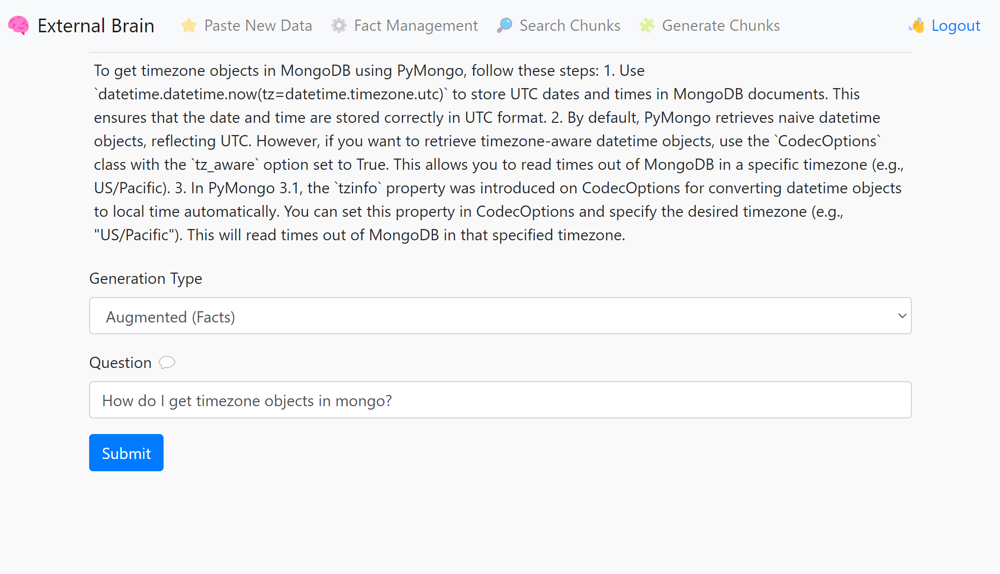
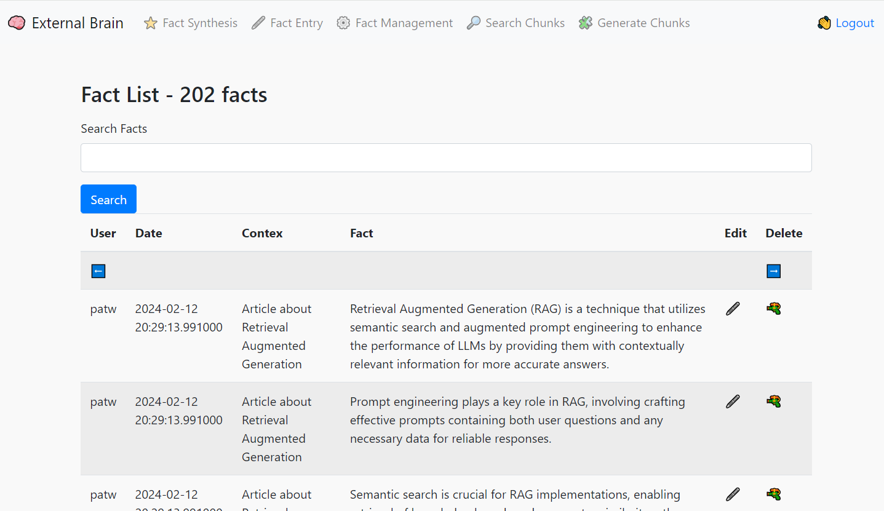
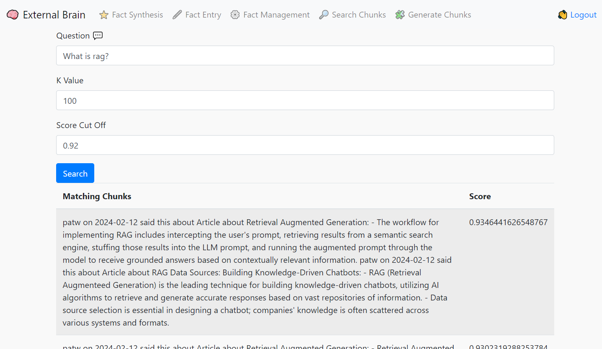

# External Brain

Facts are all you need (tm) ... and maybe an LLM, a text embedder, mongo and some python!

External Brain is a tool for asserting facts or writing down your thoughts, storing them in a durable data store and giving you the ability to ask an LLM questions about them later.

* Use the input tool to summarize whatever text you send it.  It will use the LLM to produce bullet point facts for all your data
* Facts get grouped into fact chunks and vectorized by a text embedder
* Questions to the External Brain will retrieve facts before answering, grouding the response with your own facts!

## Compatibility

External Brain was designed around using llama.cpp in server mode, however it can now be run with OpenAI or Mistral.ai keys! Check out the sample.env file for configuration options.





## Basic Installation

```
pip install -r requirements.txt
```

## Configuration

Copy the sample.env file to .env and edit this file.  This contains all the important configuration variables for the application to run.

* MONGO_CON - This will be your srv style connection into Atlas Mongo, you can get this from the Atlas UI by selecting Connection and using python for the language
* MONGO_DB - The database you want to connect to.  "extbrain" is default.
* SECRET_KEY - This is the session key for Flask, it can be anything you want
* USERS - This is a json doc of user/password keys, set this to something you remember so you can log into system
* API_KEY - This is the key that the discord_bot, slack_Bot and web_bot need to connect to extBrain, set it to something strong and complex and use the same key in those tools
* SERVICE - This can be "local" for llama.cpp in server mode + InstructorVec,  "mistral" for Mistral.ai or "openai" for OpenAI
* MODEL_NAME - This is the model name to use with each service.  Local doesn't use this but Mistral and OpenAI need this configured.
* OPENAI_API_KEY - This is your OpenAI Key. You only need this configured if you are using OpenAI. 
* MISTRAL_API_KEY - This is your Mistral.ai Key. You only need this configured if you are using Mistral.ai.

## Running extBrain

After the application has been configured (.env is correct), you can start it with the script files and load the UI by going to:

http://localhost:7861

### Linux / MacOS 

```
./extbrain.sh
```

### Windows 

```
extbrain.bat
```

## Setting up Vector Search Indexes

Add the following index definition to the ```chunks``` collection.  Change the dimensions field to match the embedding model you are using.  InstructorVec outputs 768d, Mistral.ai uses 1024d and OpenAI uses 1536d.

**NOTE**: These collections must already be created first, so add a few facts in the UI and generate the chunks to ensure these collections exist.

```
{
  "analyzer": "lucene.english",
  "mappings": {
    "dynamic": false,
    "fields": {
      "fact_chunk": {
        "type": "string"
      },
      "chunk_embedding": [
        {
          "type": "knnVector",
          "dimensions": 768 | 1024 | 1536,
          "similarity": "cosine"
        }      
      ]    
    } 
  }
}
```

Add the following index definition to the ```facts``` collection

```
{
  "mappings": {
    "dynamic": false,
    "fields": {
      "context": {
        "type": "string"
      },
      "fact": {
        "type": "string"
      }
    }
  },
  "analyzer": "lucene.english"
}
```

# Local Mode Configuration - Ignore if you use OpenAI or Mistral.ai

If you want to run extBrain entirely locally, without using any cloud provider you can! Follow the instructions below to install a vectorizer service and an LLM.  I highly recommend an M1/M2/M3 mac for this task or a PC with an nVidia graphics card and at least 8 gigs of VRAM.  It will run on CPU, but the experience is really poor compared to these accelerated plaforms.

## Config files

Rename the model.json.sample to model.json.  This file is used to set the prompt format and ban tokens, the default is ChatML format so it should work with most recent models.  Set the llama_endpoint to point to your llama.cpp running in server mode.

Rename embedder.json.sample to embedder.json and point to the endpoint of your InstructVec service.

## Setting up the Text Embedder

Install and configure https://github.com/patw/InstructorVec

Detailed instructions are in that repo.

## Downloading an LLM model

We highly recommend OpenHermes 2.5 Mistral-7b fine tune for this task, as it's currently the best (Feb 2024) that
I've tested. You can find different quantized versions of the model here:

https://huggingface.co/TheBloke/OpenHermes-2.5-Mistral-7B-GGUF/tree/main

I'd suggest the Q6 quant for GPU and Q4_K_M for CPU

## Running a model on llama.cpp in API mode

### Windows

Go to the llama.cpp releases and download either the win-avx2 package for CPU or the cublas for nvidia cards:

https://github.com/ggerganov/llama.cpp/releases

Extract the files out and run the following for nvidia GPUs:
```
server.exe -m <model>.gguf -t 4 -c 2048 -ngl 99 --host 0.0.0.0 --port 8086
```

For CPU only:
```
server.exe -m <model>.gguf -c 2048 --host 0.0.0.0 --port 8086
```

Replace <model> with whatever model you downloaded and put into the llama.cpp directory

### Linux, MacOS or WSL2
 
Follow the install instructions for llama.cpp at https://github.com/ggerganov/llama.cpp

Git clone, compile and run the following for GPU:
```
./server -m models/<model>.gguf -t 4 -c 2048 -ngl 99 --host 0.0.0.0 --port 8086
```

For CPU only:
```
./server -m models/<model>.gguf -c 2048 --host 0.0.0.0 --port 8086
```

Replace <model> with whatever model you downloaded and put into the llama.cpp/models directory
