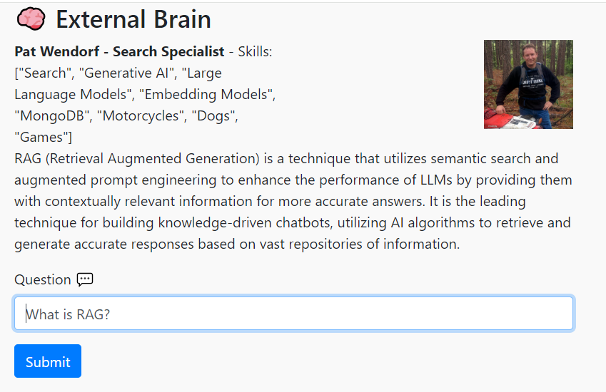

# External Brain - Web UI Bot

A web front end for external brain.  This allows you to provide a site to answer questions based on whatever knowledge you've added into externalbrain

## Compatibility

External Brain was designed around using llama.cpp in server mode, however it can now be run with OpenAI or Mistral.ai keys! Check out the sample.env file for configuration options.



## Basic Installation

```
pip install -r requirements.txt
```

## Configuration

Copy the sample.env file to .env and edit this file.  This contains all the important configuration variables for the application to run.

* BRAIN_URL - This is the URL to wherever extBrain is running.  If running on localhost the default is correct.
* API_KEY - This is the security API key you configured in extBrain, just make sure they match here.
* SECRET_KEY - Flask session key, just set it to something complex
* BOT_NAME - The name of your bot, it shows up in the UI
* BOT_IDENTITY - This is the "personality" your bot will have, experiment!
* BOT_SKILLS - This is to show the users what skills your bot might have, it's an array

## Running

### MacOS / Linux

```
python3 -m flask run
```

### Windows

```
flask run
```